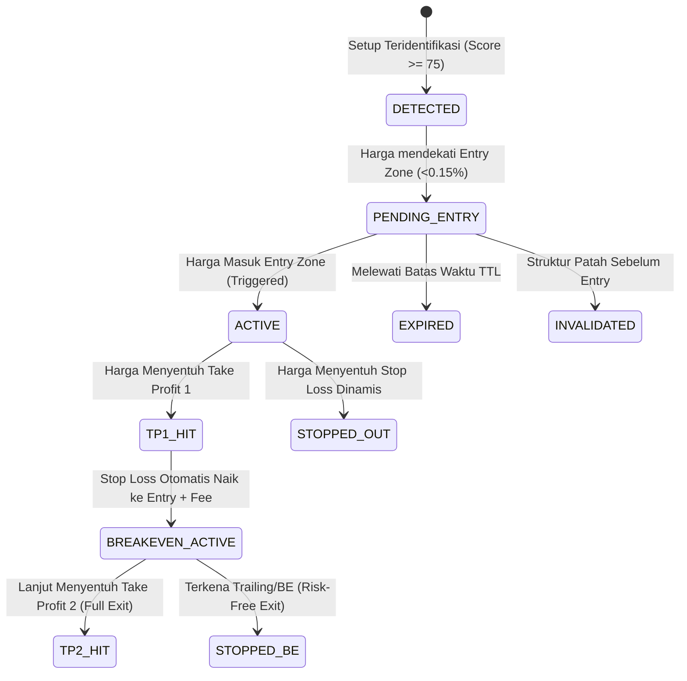

# KriptoYoi Scalping Analyzer — Roadmap Addendum & Spesifikasi Teknis

> **Dokumen Pelengkap (Addendum) untuk:** `KriptoYoi_Scalping_Analyzer_Roadmap.pdf`  
> **Versi:** 1.0  
> **Fokus:** Spesifikasi Kuantitatif, Friction Cost Engine, Proteksi Pasar Makro, dan State Machine Eksekusi.

---

## 1. Latar Belakang & Urgensi Addendum

Dokumen roadmap utama telah mendefinisikan visi, modul, dan arsitektur analitik secara komprehensif. Dokumen addendum ini disusun untuk melengkapi **aturan deterministik (matematis)**, **batasan ekosistem bursa lokal (Tokocrypto/Binance Cloud)**, serta **manajemen risiko eksekusi** di dunia nyata.

---

## 2. Friction Cost Engine (Biaya Transaksi & Pajak Kripto Indonesia)

### 2.1. Realitas Biaya Transaksi Tokocrypto (Spot)
Di pasar spot Indonesia (Tokocrypto / Bappebti / PMK 68/2022), setiap transaksi dikenakan:
1. **Trading Fee:** 0.10% (atau 0.075% jika menggunakan diskon BNB).
2. **Pajak PPh Final:** 0.10% (untuk pedagang terdaftar Bappebti).
3. **PPN:** 0.11%.
4. **Estimasi Slippage Eksekusi:** Rata-rata 0.05% – 0.10% pada koin likuiditas menengah.

$$\text{Friction Round-Trip} = (\text{Fee}_{\text{buy}} + \text{PPh}_{\text{buy}} + \text{PPN}_{\text{buy}}) + (\text{Fee}_{\text{sell}} + \text{PPh}_{\text{sell}} + \text{PPN}_{\text{sell}}) + \text{Slippage} \approx \mathbf{0.35\% - 0.45\%}$$

### 2.2. Validasi Net Risk-to-Reward (Net R:R)
Setup scalping **dilarang dievaluasi menggunakan Gross R:R**. Semua kalkulasi harus menggunakan formula Net:

$$\text{Net Profit Target} = (\text{TP Price} - \text{Entry Price}) - \text{Total Friction}$$

$$\text{Net Stop Loss} = (\text{Entry Price} - \text{SL Price}) + \text{Total Friction}$$

$$\text{Net R:R} = \frac{\text{Net Profit Target}}{\text{Net Stop Loss}}$$

> **Aturan Filter:**
> - Jika $\text{Net R:R} < 1.2$, status setup otomatis dinyatakan **`NO TRADE (FEE_UNVIABLE)`**.
> - Jarak TP1 minimal harus $\ge 2.5 \times \text{Total Friction}$ (minimal kenaikan ~0.9% - 1.1% pada timeframe 5M).

---

## 3. Spot vs. Futures & Orientasi Arah (Directional Scope)

### 3.1. Kebijakan Pasar Spot Tokocrypto
* Tokocrypto adalah pasar spot. Pada akun spot standar, trader **tidak dapat membuka posisi Short (Sell First)** untuk mencari keuntungan saat harga turun.
* **Klasifikasi Sinyal Sesuai Scope:**
  1. **Mode Spot (Default):**
     - Sinyal **BUY / LONG**: Rekomendasi entry beli.
     - Sinyal **SELL / SHORT**: Dialihkan menjadi **EXIT ALERT / TAKE PROFIT / PRE-DUMP WARNING** bagi pemegang aset, bukan posisi margin short.
  2. **Mode Futures (Future Expansion):**
     - Membuka kedua arah (Long & Short) menggunakan integrasi data Binance Futures.

---

## 4. Algorithmic Precision: Formula Matematis & Definisi Baku

### 4.1. Deteksi Swing High (SH) & Swing Low (SL)
Menggunakan algoritma Fraktal Simetris $N$-Bars ($N=2$ untuk 1M/5M scalping, $N=3$ untuk 15M):
* **Swing High:** Sebuah candle pada indeks $i$ dengan high $H_i$ adalah Swing High valid jika:
  $$H_i > H_{i-k} \quad \text{dan} \quad H_i > H_{i+k} \quad \forall k \in [1, N]$$
* **Swing Low:** Sebuah candle pada indeks $i$ dengan low $L_i$ adalah Swing Low valid jika:
  $$L_i < L_{i-k} \quad \text{dan} \quad L_i < L_{i+k} \quad \forall k \in [1, N]$$

### 4.2. Break of Structure (BOS) vs. Liquidity Sweep
* **Break of Structure (BOS):**
  - Terjadi ketika **Body Close** candle melewati level Swing High sebelumnya (Bullish BOS) atau Swing Low sebelumnya (Bearish BOS):
    $$\text{Bullish BOS}: \text{Close} > \text{Previous Swing High}$$
    $$\text{Bearish BOS}: \text{Close} < \text{Previous Swing Low}$$
* **Liquidity Sweep (Stop Hunt / Fakeout):**
  - Terjadi ketika **Wick** menembus level Swing High/Low, namun **Body Close** tetap berada di dalam range, diikuti rejection dalam $1-2$ candle:
    $$\text{Sweep Bullish}: \text{High} > \text{Prev Swing High} \quad \text{namun} \quad \text{Close} \le \text{Prev Swing High}$$

### 4.3. Relative Volume (RVOL) & Volume Spike
* Menggunakan basis 20 periode SMA pada timeframe aktif:
  $$\text{SMA\_Vol}_{20} = \frac{1}{20} \sum_{j=1}^{20} \text{Volume}_{t-j}$$
  $$\text{RVOL} = \frac{\text{Volume}_t}{\text{SMA\_Vol}_{20}}$$
* **Klasifikasi Volume:**
  - $\text{RVOL} < 0.8$: **LOW VOLUME** (Hindari Breakout)
  - $0.8 \le \text{RVOL} \le 1.5$: **NORMAL VOLUME**
  - $1.5 < \text{RVOL} \le 2.5$: **HIGH VOLUME** (Konfirmasi Breakout)
  - $\text{RVOL} > 2.5$: **VOLUME SPIKE / CLIMACTIC** (Waspada Exhaustion)

### 4.4. Signal Time-To-Live (TTL / Expiration)
Setiap setup scalping memiliki batas waktu kedaluwarsa:
* Untuk setup berbasis 1M: Maksimal **5 candle (5 menit)** tanpa triggered $\rightarrow$ **`EXPIRED`**.
* Untuk setup berbasis 5M: Maksimal **6 candle (30 menit)** tanpa triggered $\rightarrow$ **`EXPIRED`**.
* Pembatalan instan terjadi jika harga menembus level invalidasi sebelum entry tercapai.

---

## 5. BTC Market Gatekeeper (Korelasi Makro Kripto)

Untuk mencegah sinyal Long palsu pada Altcoin ketika Bitcoin mengalami *flash dump*:
1. **BTC Pulse Monitor:**
   - Sistem secara background memonitor kline 5M dan 1M dari pasangan `BTCUSDT`.
2. **Kondisi BTC Dump Risk (Veto Condition):**
   - Jika `BTC 5M Close < BTC EMA 20` DAN `BTC 5M Return < -0.6%` dalam 1-2 candle terakhir.
   - Atau `BTC ATR Ratio > 2.5` dengan arah bearish impulsif.
3. **Aksi Sistem:**
   - Semua sinyal Long altcoin langsung di-override menjadi **`WAIT (BTC DUMP RISK)`**.

---

## 6. Trade Lifecycle State Machine



### 6.1. Manajemen Posisi Pasca-Entry:
* **TP1 Tercapai:** Ambil profit parsial 50%, pindahkan Stop Loss ke level Breakeven (Entry + 0.35% buffer fee).
* **TP2 Tercapai:** Ambil sisa 50% profit.

---

## 7. Arsitektur Data Historis & Rate-Limit Shield

1. **Local Time-Series Store (DuckDB / SQLite):**
   - Mengingat Tokocrypto API membatasi 1000 klines per request, backend menyimpan klines historis ke database lokal terkompresi.
   - Update klines berjalan via WebSocket streaming, bukan polling HTTP berulang.
2. **Background Multi-Timeframe Cache:**
   - Klines 1H, 15M, 5M, 1M disimpan di in-memory cache dengan pembaruan delta candle agar kalkulasi analisa kuantitatif instan (< 15ms).

---

## 8. Notifikasi Multi-Channel
* **Audio Web Alert:** Web Audio API sintesis beep (Dual Frequency Chime) di dashboard saat setup mencapai status `ACTIVE`.
* **Telegram Bot Webhook:** Format pesan ringkas:
  ```text
  ⚡ KRIPTOYOI SCALP ALERT: SOL/USDT
  Arah: LONG (Pullback) | Score: 84/100 (STRONG)
  Entry: 142.20 - 142.50
  SL: 141.30 (ATR Dynamic)
  TP1: 143.80 | TP2: 144.90
  Net R:R: 1 : 2.2
  MTF Confluence: 4/4 BULLISH
  ```
